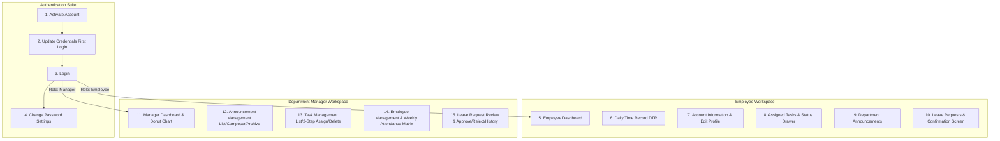
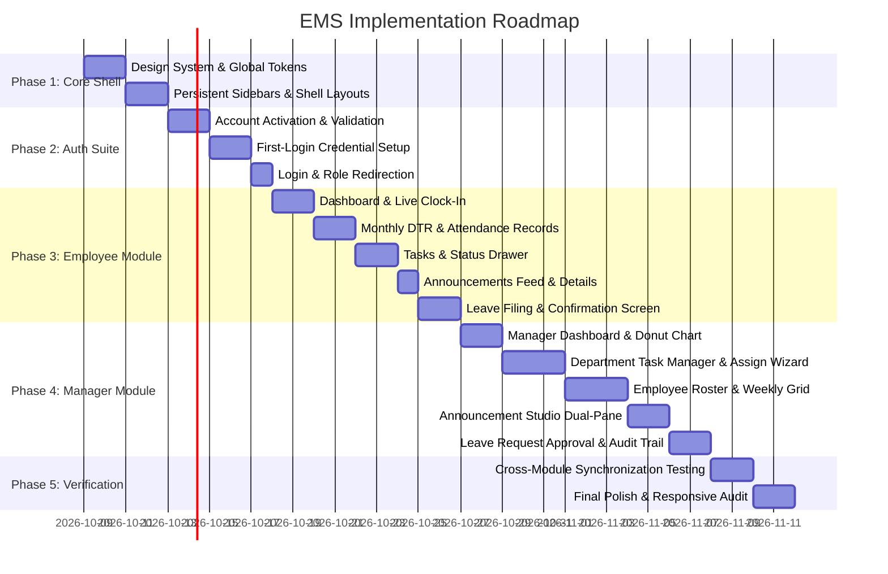

# Quicktouch™ / JobQuest Employee Management System (EMS)
## Comprehensive Architecture & Implementation Master Plan

> **Document Version:** 1.0.0  
> **Prepared For:** Charles Joshua A. Lising — EMS Application  
> **Source Baseline:** [JobQuest EMS Documentation v1.0 (E:\JobQuest EMS Documentation.md)](file:///e:/JobQuest%20EMS%20Documentation.md)  
> **Design Authority:** [frontend-design/SKILLS.md](file:///c:/Users/COMPUTER%20CENTER/Desktop/ems/.agent/skills/frontend-design/SKILLS.md)  
> **Technology Stack:** Next.js 16 (App Router) + React 19 + TypeScript + Vanilla CSS Modules  

---

## 1. Executive Summary & Product Vision

The **Quicktouch™ / JobQuest Employee Management System (EMS)** is an intuitive, web-based workplace operations platform engineered to centralize day-to-day operations for both staff employees and department managers.

Developed as a school project exploring **Agentic Coding** within a focused development timeframe, the system balances real-world enterprise capabilities with an elegant, streamlined architecture.

### Key Operational Tenets
1. **Two Distinct Role Workspaces**:
   - **Employee Workspace**: Focuses on personal productivity, attendance logging (DTR), task status reporting, company notices, and leave request submissions with real-time balance tracking.
   - **Department Manager Workspace**: Department-scoped command center for assigning and monitoring team tasks, publishing notices, tracking weekly employee attendance grids, and adjudicating leave requests with full audit logs.
2. **Simplified Administration via Intelligent Mock Data**:
   - Rather than creating an overburdened HR Admin role, initial employee records, department structures, and default credentials are provided through high-fidelity mockup data stores that simulate enterprise directory provisioning.
3. **Mandatory Onboarding & Security Flow**:
   - First-time users undergo a strict two-step onboarding sequence: Employee ID & Company Email validation followed by mandatory credential setting (Username + 8+ char complex password) before gaining workspace access.
4. **Desktop-First Density with Modern Human Ergonomics**:
   - Optimized for desktop viewport resolutions (1280px to 1920px) featuring persistent left sidebars, split-pane managers, synchronized data tables, live preview sidebars, and slide-over update panels.

---

## 2. Design System & Visual Identity

Grounded in [frontend-design/SKILLS.md](file:///c:/Users/COMPUTER%20CENTER/Desktop/ems/.agent/skills/frontend-design/SKILLS.md), this application rejects generic AI templates (no uninspired Claude terracotta, no clichéd SaaS dark cards with neon green). It expands upon the existing, elegant JobQuest brand identity: Deep Crimson/Burgundy paired with Warm Ivory and clean, high-contrast typography.

### 2.1 Core Color Palette Tokens

| Token Variable | Hex Code | Semantic Role & UI Application |
|---|---|---|
| `--color-brand-primary` | `#590B28` | Deep Velvet Burgundy — Primary brand headers, active sidebar items, primary buttons |
| `--color-brand-hover` | `#750F36` | Rich Crimson Hover — Button hover states, interactive focus rings |
| `--color-brand-subtle` | `#FFF0DF` | Warm Champagne/Almond Canvas — Page background, side panel ambient backdrop |
| `--color-surface-white` | `#FFFFFF` | Pure White Surface — Elevated cards, modal dialogs, data table containers |
| `--color-border-subtle` | `#E2DDD6` | Warm Sand Border — Card perimeters, table dividers, input borders |
| `--color-text-main` | `#151515` | Jet Carbon — High-contrast titles, primary table values, input text |
| `--color-text-muted` | `#64748B` | Slate Ash — Secondary labels, helper instructions, timestamps |
| `--color-status-present` | `#059669` | Emerald — Present attendance status, Approved leave, Published notices |
| `--color-status-late` | `#D97706` | Warm Amber — Late clock-in, In Progress tasks, Pending leave approval |
| `--color-status-absent` | `#DC2626` | Ruby Red — Absent days, Overdue tasks, Rejected leave requests |
| `--color-status-leave` | `#0284C7` | Ocean Blue — On Leave status, Department announcements |

### 2.2 Typographic Hierarchy
- **Display & Headings**: `Plus Jakarta Sans` / `Outfit` (Bold 700 & ExtraBold 800) with tight letter tracking (`-0.02em`) and clear vertical cadence.
- **Body & Data Tables**: `Inter` / System Sans (Regular 400 & Medium 500), line heights strictly maintained between `1.4` and `1.6`, with line lengths capped under 75 characters for prose.
- **Data & Numbers**: Numbers in DTR, Leave Balances, and Employee IDs use tabular figures (`font-variant-numeric: tabular-nums`) to ensure vertical alignment across data grids.

### 2.3 Copywriting & Micro-Interaction Standards
- **Active Verbs**: Buttons describe explicit outcomes: `"Submit Request"`, `"Approve"`, `"Reject"`, `"Assign Task"`, `"Save as Draft"`, `"Publish Announcement"`.
- **Informative Empty & Error States**: Zero-state panels give direct calls to action (e.g., *"No tasks currently in progress. Check assigned duties or review completed tasks."*).
- **Subtle Feedback Motion**: Clean 160ms transitions on state toggles; slide-over panels ease in with `cubic-bezier(0.16, 1, 0.3, 1)`; no noisy, gratuitous entrance animations.

---

## 3. Screen Inventory & Information Architecture

The system encompasses **15 primary screens and interactive sub-dialogs** partitioned across Authentication, Employee, and Department Manager modules:



---

## 4. Module-by-Module Functional Specification

### 4.1 Authentication & Account Activation

#### Screen 1: Activate Account (`/activate-account`)
- **Purpose**: First-time account onboarding for newly hired employees and managers.
- **Inputs**:
  - Employee ID (`input[type="text"]`, placeholder e.g. `24-2545-483`)
  - Company Email (`input[type="email"]`, placeholder e.g. `charles@quicktouch.com`)
- **Validation**:
  - Matching pair verification against mock organization directory.
  - Non-matching or unrecognized Employee ID triggers descriptive inline error message.
- **Actions**:
  - `Activate Account` button — Validates and routes directly to Credential Setup.
  - `Back to Login` link.

#### Screen 2: Update User Credentials (`/update-credentials`)
- **Purpose**: Mandatory first-login security gate. Prevents access until custom credentials are created.
- **Inputs**:
  - Username (`@handle` format, min 4 characters)
  - New Password (`password` input with eye toggle)
  - Confirm Password
- **Live Password Strength Meter & Checklist**:
  - [x] At least 8 characters
  - [x] Uppercase and lowercase letters
  - [x] At least one number or special character
- **Actions**:
  - `Update Credentials` (commits credentials to mock store and unlocks dashboard access). No option to skip.

#### Screen 3: Login (`/login` or `/`)
- **Inputs**: Username, Password, "Remember Me" checkbox.
- **Actions**:
  - `Login` button (detects role: routes to `/employee/dashboard` or `/manager/dashboard`).
  - `Forgot Password?` (opens recovery modal with simulated reset link instruction).
  - `Go to activate your account` link.

#### Screen 4: Change Password (`/settings/change-password`)
- **Purpose**: Account security maintenance for authenticated users.
- **Fields**: Current Password, New Password, Confirm New Password with real-time strength meter.

---

### 4.2 Employee Module

#### Screen 5: Employee Dashboard (`/employee/dashboard`)
- **Summary Header Cards**:
  - **Attendance Today**: Current status (Present / Late / Not Clocked In), Time-In stamp, live Clock In/Out button.
  - **My Tasks**: Total active tasks count, indicator for tasks due today.
  - **Leave Balance**: Remaining Vacation & Sick leave days, count of pending requests.
  - **Recent Announcements**: Top 2 latest bulletins with priority tags.
- **My Attendance Today Panel**:
  - Detailed daily overview: Current Date, Time In, Time Out, Calculated Hours Worked, Status badge.
- **Quick Links**: Direct shortcuts to DTR, My Tasks, Leave Filing, and Announcement Feed.

#### Screen 6: Daily Time Record (DTR) (`/employee/dtr`)
- **Summary Metrics**: Days Present, Days Late, Total Hours Rendered, Days Absent for the selected period.
- **Interactive Controls**: Month/Year selector dropdown (e.g., October 2026), search bar.
- **Attendance Log Table**:
  - Columns: `Date`, `Day`, `Time In`, `Time Out`, `Total Hours`, `Status` (Present / Late / Absent), `Remarks`.
  - Pagination controls (10 records per page).

#### Screen 7: Account Information (`/employee/profile`)
- **Two Tabbed Views**:
  1. **Personal Information** (User-editable):
     - First Name, Last Name, Email Address, Alternate Email, Contact Number, Home Address, Date of Birth, Gender, Civil Status.
     - Action: `Edit Profile` opens editable form with `Update Profile` and `Cancel`.
  2. **Company Information** (Locked / HR-controlled):
     - Employee ID, Assigned Department, Position, Date Hired, Employment Type (Full-time / Regular), Work Location, Reports To (Manager Name).
     - Visual badge: *"Assigned by the company — Locked for editing"*.

#### Screen 8: Assigned Tasks (`/employee/tasks`)
- **Tab Filters**: `All Tasks`, `Due Today`, `In Progress`, `Completed`.
- **Task Cards**:
  - Task Title, Assigning Manager & Department, Priority badge (`High` / `Medium` / `Low`), Due Date countdown, Status badge, Full description snippet.
- **Update Task Status Drawer (Slide-Over Panel)**:
  - Read-only task summary.
  - Status Dropdown: `To-do`, `In Progress`, `Completed`, `Overdue`.
  - Employee Remarks textarea.
  - Optional Attachment upload field.
  - Actions: `Save Update`, `Cancel`.

#### Screen 9: Department Announcements (`/employee/announcements`)
- **Filter Tabs**: `All`, `Company Update`, `Policy`, `Events`, `Others`.
- **Search & Filters**: Keyword search bar + Date posted filter.
- **Announcement Cards**: Category badge, Title, Excerpt, Posting Manager, Timestamp.
- **Announcement Details Modal**:
  - Full announcement read-only modal displaying header, manager avatar, publication date, complete message body, and attachment preview with download button.

#### Screen 10: Leave Request & Submission (`/employee/leave`)
- **Leave Balance Cards**:
  - Vacation Leave (e.g. 12/15 days available)
  - Sick Leave (e.g. 8/10 days available)
  - Special Privilege Leave (3/3 days available)
  - Maternity / Paternity Leave (eligible days)
- **Create Leave Request Form**:
  - Leave Type selector, Start Date, End Date, Total Days (auto-computed excluding weekends).
  - Reason Category & Detailed Reason textarea.
  - Contact Number during absence.
  - File Attachment (medical certificate, travel permit, etc.).
  - Actions: `Submit Request`, `Clear Form`.
- **Leave Request Status History Table**:
  - Columns: `Request ID`, `Leave Type`, `Start Date`, `End Date`, `Days`, `Status` (Pending / Approved / Rejected), `Date Filed`, `Actions`.
- **Screen 10b: Submission Confirmation Screen (`/employee/leave/confirmed`)**:
  - Displays Request ID, Type, Duration, Status (*Pending Approval*).
  - *"What Happens Next"* checklist (Manager notification -> 48hr review window -> Email status dispatch).
  - Shortcuts: `View Leave Status`, `Back to Dashboard`.

---

### 4.3 Department Manager Module

#### Screen 11: Manager Dashboard (`/manager/dashboard`)
- **Daily Department KPI Cards**:
  - Present, Late, Absent, On Leave employee counts for today.
- **Attendance Overview Donut Chart**:
  - Visual breakdown of department presence with percentage distribution, filterable by time range (Today / This Week / This Month).
- **Team Task Overview**:
  - Interactive status bars: To Do, In Progress, Completed, Overdue counters with percentage completion.
- **Recent Department Announcements**: Latest 3 departmental communications.
- **Upcoming Leave Requests**: Pending requests needing immediate manager adjudication.

#### Screen 12: Department Announcement Management (`/manager/announcements`)
- **Announcement List**:
  - Tabs: `All Announcements`, `Published`, `Drafts`, `Archived`.
  - Search keyword bar + Status filter.
  - Actions: `Create Announcement`, `View Details`, `Edit`, `Archive`.
- **Create / Edit Announcement (Dual-Pane Studio)**:
  - Left Pane (Editor): Category selector, Title (char limit with live counter), Message (char limit with live counter), Attachment upload, Department scope confirmation notice.
  - Right Pane (Live Preview): Real-time mirror showing exactly how the bulletin appears on employee screens.
  - Actions: `Save as Draft`, `Publish Announcement`, `Cancel`.
- **Archive Confirmation Modal**:
  - Safe archive modal explaining the post will be hidden from employees but retrievable in the Archived tab.

#### Screen 13: Task Management (`/manager/tasks`)
- **Task KPI Summary**: Total Tasks, Pending, In Progress, Completed counters.
- **Filterable Task Table**:
  - Columns: `Task Title`, `Category`, `Assigned To` (Employee names + avatars), `Priority`, `Due Date`, `Status`, `Actions`.
- **Assign Task Form (2-Step Modal / Wizard)**:
  - *Section 1 - Task Information*: Title, Category, Priority (Low / Medium / High), Description, Start Date, Due Date, File Attachment.
  - *Section 2 - Assign To*: Searchable multi-select employee roster with department filter.
  - *Live Task Preview*: Summary box displaying card preview prior to assignment.
  - *Quick Tips Card*: Best practice authoring guidelines.
  - Action: `Assign Task`.
- **Edit & Delete Modals**:
  - Edit Task updates fields with read-only assignment.
  - Delete Task displays confirmation modal with warning: *"Action cannot be undone"*.

#### Screen 14: Employee Management & Attendance Matrix (`/manager/employees`)
- **Department Roster Tab**:
  - Summary Cards: Total Employees, Active, On Leave, New Hires.
  - Table: `Employee ID`, `Name`, `Position`, `Status` (Active / On Leave / Inactive), `Date Hired`, `Action`.
  - `View Profile`: Detailed read-only profile modal (Photo, Contact info, Employment details, Reporting line).
- **Department Attendance Record Tab**:
  - KPI Cards: Present / Late / Absent / On Leave / Total Employees.
  - Search bar + Date range picker.
  - **Weekly Attendance Grid (Monday through Friday)**:
    - Per-employee row displaying each day's status chip (`Present 8:02 AM`, `Late 9:15 AM`, `Absent`, `On Leave`).
    - Actions: `View Details` (slides open Attendance Details panel), `Download Report` (generates simulated CSV/PDF export).
- **Attendance Details Slide-Out Drawer**:
  - Employee photo, ID, position.
  - Daily breakdown: Date, Status, Time-In, Time-Out, Hours Worked.
  - Weekly summary tallies (Present / Late / Absent / On Leave).

#### Screen 15: Leave Request Management (`/manager/leaves`)
- **Adjudication Summary Cards**: Total Requests, Pending, Approved, Rejected.
- **Request Queue Table**:
  - Columns: `#`, `Employee`, `Leave Type`, `Start Date`, `End Date`, `Days`, `Status`, `Action`.
- **Leave Request Details Modal**:
  - Tab 1 (`Details`): Type, Dates, Total Days, Filed Date, Reason, Attached Proof preview.
  - Tab 2 (`Activity Log`): Chronological audit trail (e.g. *Filed by Charles -> Reviewed by Manager -> Status Changed*).
- **Approve Dialog**:
  - Employee summary, dates, reason, optional manager remarks input, `Approve` button.
- **Reject Dialog**:
  - Employee summary, mandatory `Reason for Rejection` textarea (displayed to employee), `Reject` button.
- **Request History Timeline View**:
  - Full audit timeline showing all status shifts and timestamps.

---

## 5. Data Architecture & TypeScript Schemas

All modules interact with a unified TypeScript state definition capable of operating in client memory and persisting to `localStorage`.

```typescript
export type Role = "EMPLOYEE" | "DEPARTMENT_MANAGER";
export type AttendanceStatus = "PRESENT" | "LATE" | "ABSENT" | "ON_LEAVE" | "NOT_CLOCKED_IN";
export type TaskPriority = "LOW" | "MEDIUM" | "HIGH";
export type TaskStatus = "TODO" | "IN_PROGRESS" | "COMPLETED" | "OVERDUE";
export type LeaveType = "VACATION" | "SICK" | "SPECIAL" | "MATERNITY";
export type LeaveStatus = "PENDING" | "APPROVED" | "REJECTED";
export type AnnouncementCategory = "COMPANY_UPDATE" | "POLICY" | "EVENTS" | "OTHERS";
export type AnnouncementStatus = "PUBLISHED" | "DRAFT" | "ARCHIVED";

export interface UserAccount {
  id: string;
  employeeId: string; // e.g. "24-2545-483"
  username: string;
  email: string;
  role: Role;
  department: string;
  position: string;
  isActivated: boolean;
  avatarUrl: string;
  personalInfo: {
    firstName: string;
    lastName: string;
    alternateEmail?: string;
    contactNumber: string;
    address: string;
    birthDate: string;
    gender: string;
    civilStatus: string;
  };
  companyInfo: {
    dateHired: string;
    employmentType: string;
    workLocation: string;
    reportsTo: string;
  };
}

export interface DTRRecord {
  id: string;
  employeeId: string;
  date: string; // YYYY-MM-DD
  dayOfWeek: string;
  timeIn?: string;
  timeOut?: string;
  totalHours: number;
  status: AttendanceStatus;
  remarks?: string;
}

export interface TaskItem {
  id: string;
  title: string;
  category: string;
  description: string;
  priority: TaskPriority;
  status: TaskStatus;
  startDate: string;
  dueDate: string;
  assignedTo: string[]; // employee IDs
  assignedBy: string;   // manager name
  department: string;
  remarks?: string;
  attachmentName?: string;
}

export interface AnnouncementItem {
  id: string;
  title: string;
  category: AnnouncementCategory;
  message: string;
  authorName: string;
  department: string;
  datePosted: string;
  status: AnnouncementStatus;
  attachmentName?: string;
}

export interface LeaveRequestItem {
  id: string; // e.g. "LR-2026-081"
  employeeId: string;
  employeeName: string;
  department: string;
  leaveType: LeaveType;
  startDate: string;
  endDate: string;
  totalDays: number;
  reason: string;
  reasonDetails?: string;
  contactNumber: string;
  attachmentName?: string;
  status: LeaveStatus;
  dateFiled: string;
  managerRemarks?: string;
  rejectionReason?: string;
  history: {
    timestamp: string;
    action: string;
    actor: string;
  }[];
}

export interface LeaveBalance {
  vacation: { available: number; total: number };
  sick: { available: number; total: number };
  special: { available: number; total: number };
  maternity: { available: number; total: number };
}
```

---

## 6. Directory Structure & App Architecture

The Next.js 16 project structure aligns clean separation of concerns between shared UI components, state providers, and role layouts:

```text
src/
├── app/
│   ├── (auth)/
│   │   ├── activate-account/page.tsx
│   │   ├── update-credentials/page.tsx
│   │   ├── login/page.tsx
│   │   └── page.tsx                     # Default to Login
│   ├── employee/
│   │   ├── layout.tsx                   # Persistent Employee Sidebar & Header
│   │   ├── dashboard/page.tsx           # Screen 5: Summary Cards & DTR snippet
│   │   ├── dtr/page.tsx                 # Screen 6: Monthly Attendance Table
│   │   ├── profile/page.tsx             # Screen 7: Personal vs Company Info
│   │   ├── tasks/page.tsx               # Screen 8: Task Cards & Status Drawer
│   │   ├── announcements/page.tsx       # Screen 9: Feed & Details Modal
│   │   └── leave/
│   │       ├── page.tsx                 # Screen 10: Filing Form & History
│   │       └── confirmed/page.tsx       # Screen 10b: Confirmation Screen
│   ├── manager/
│   │   ├── layout.tsx                   # Persistent Manager Sidebar & Header
│   │   ├── dashboard/page.tsx           # Screen 11: KPI & Attendance Donut
│   │   ├── announcements/
│   │   │   ├── page.tsx                 # Screen 12: List & Archive Tabs
│   │   │   └── create/page.tsx          # Screen 12b: Dual-Pane Composer
│   │   ├── tasks/
│   │   │   ├── page.tsx                 # Screen 13: Task Roster Table
│   │   │   └── assign/page.tsx          # Screen 13b: 2-Step Assign Wizard
│   │   ├── employees/page.tsx           # Screen 14: Roster & Weekly Grid
│   │   └── leaves/page.tsx              # Screen 15: Review & Adjudication
│   ├── globals.css                      # Core tokens & responsive defaults
│   └── layout.tsx                       # Root HTML & Providers
├── components/
│   ├── auth/                            # AuthLayout, CredentialsForm, etc.
│   ├── common/                          # StatusBadge, Modal, Drawer, Table
│   ├── employee/                        # ClockWidget, LeaveForm, TaskDrawer
│   └── manager/                         # WeeklyGrid, DonutChart, TaskWizard
└── context/
    └── EmsStore.tsx                     # Unified React Context + LocalStorage
```

---

## 7. Implementation Roadmap & Phases



### Phase-by-Phase Deliverables

#### Phase 1: Foundation & Shared Shell (Days 1–4)
- Establish CSS custom property tokens for the Burgundy/Warm Ivory theme.
- Build responsive desktop sidebar navigation with active path markers.
- Implement reusable UI primitives: `StatusBadge`, `MetricCard`, `ModalDialog`, `SlideDrawer`.

#### Phase 2: Authentication & Onboarding (Days 5–9)
- Implement `/activate-account` with mock directory ID + email lookup.
- Implement `/update-credentials` with live 3-point password strength checklist.
- Implement `/login` with role selection persistence and invalid credential alerts.

#### Phase 3: Employee Workspace (Days 10–18)
- Complete Employee Dashboard with working Clock-In / Clock-Out state toggle.
- Build DTR table with month selector and automatic hours calculation.
- Build Assigned Tasks board with slide-out status modification drawer.
- Implement Announcement reading view with attachments download.
- Implement Leave filing with automatic duration calculation and confirmation receipt.

#### Phase 4: Manager Workspace (Days 19–29)
- Build Manager Dashboard featuring real-time attendance donut chart and team task meters.
- Construct 2-step Task Assignment wizard with live card preview and employee multi-select.
- Implement Department Attendance weekly grid (Monday–Friday) with daily status chips.
- Build Announcement Management with live preview composer and archive functionality.
- Build Leave Request adjudication with Approval remarks, Rejection reason, and History timeline.

#### Phase 5: Mock Store Integration & Polish (Days 30–33)
- Integrate unified `EmsStore` with `localStorage` so changes made in Manager views (e.g. approving leave or assigning tasks) immediately reflect in Employee views.
- Conduct keyboard navigation, accessibility, and high-density viewport polish.

---

## 8. Quality Assurance & Verification Matrix

| Screen / Feature | Acceptance Criteria | Test Status |
|---|---|---|
| **Account Activation** | Unmatched Employee ID or email shows inline error; valid pair advances to credential setup. | [ ] Pending |
| **Credential Setup** | Rejects passwords under 8 chars or missing mixed case/numbers; successful submit unlocks access. | [ ] Pending |
| **Login Routing** | Employee credentials navigate to `/employee/dashboard`; Manager credentials navigate to `/manager/dashboard`. | [ ] Pending |
| **Employee DTR** | Clock-in stamps live time; month filter updates table rows; total hours calculate accurately. | [ ] Pending |
| **Profile Locking** | Personal fields can be edited and saved; Company ID, Department, Position remain disabled. | [ ] Pending |
| **Task Status Drawer** | Changing status from `To-do` to `In Progress` updates card badge and manager task overview. | [ ] Pending |
| **Leave Filing** | Form computes total working days; submission generates Request ID and navigates to Confirmation screen. | [ ] Pending |
| **Manager Donut Chart** | Percentages match exact count of Present, Late, Absent, and On Leave personnel. | [ ] Pending |
| **Assign Task Wizard** | Step 1 validates dates; Step 2 supports multi-employee selection; live preview updates in real-time. | [ ] Pending |
| **Weekly Attendance Grid** | Displays 5-day week for each department member with correct color-coded status badges. | [ ] Pending |
| **Leave Approval** | Approving updates status to `Approved` and decrements employee's leave balance in real-time. | [ ] Pending |
| **Leave Rejection** | Rejection requires non-empty reason; updates status to `Rejected` with manager explanation. | [ ] Pending |
| **Announcement Composer**| Live preview mirrors title, category badge, and formatted message prior to publishing. | [ ] Pending |

---

*This architecture and implementation blueprint serves as the official specification for Quicktouch™ / JobQuest EMS. All component designs, route structures, and interactions are designed for turnkey execution.*